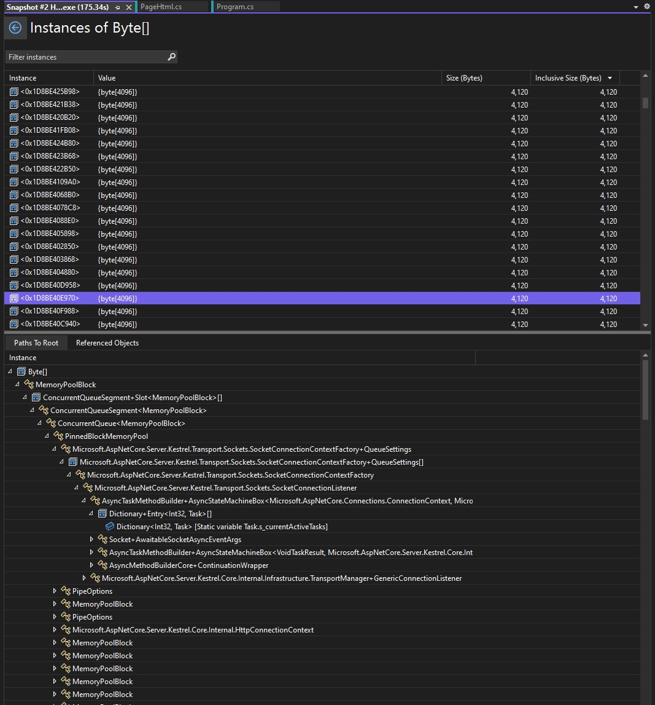

# ASP.NET Core Large File Upload Examples
A minimal reproducible example to compare and contrast some uploading methods for large files.

## Background
While playing with a personal project, I became interested in large file uploads to ASP.NET Core minimal APIs. I'm a fan of shifting the [smallest number of bytes](https://github.com/nikouu/TinyWordle) the [fastest way possible](https://github.com/nikouu/dotnet-optimization-cheatsheet) and thought to add the constraint of being able to host a free tier Azure Web App to pass a large uploaded file to Azure Blob Storage. The challenge here is the file should be larger than both the RAM and disk combined for a free tier web app. This means the file in its entirity cannot be buffered to disk and/or memory.

*As of writing this, the Azure Web App free tier (F1) has 1 GB RAM and 1 GB Storage.*

## Desired Outcome
To understand better how Kestrel (I think) handles large body requests. Ultimately I'd be keen to know if there is a way to "hot potato" the data from incoming to outgoing while keeping memory usage as low as the CPU will allow it.

The problem isn't how to upload large files, it's how to upload large files in the most memory and disk efficient way. Hopefully by reusing the same space in memory as data comes in and gets shuffled out.

I totally understand if this is a back pressure issue that I don't comprehend. There would be an incredible balance of transfer in speed and write out speed have a clean and balanced memory footprint. Though see Further Thought 4 below for more.

And large files in my mind are gigabytes.

## How to Use

1. Download
2. Run the project
3. Pick one of the examples on the page by uploading a file and clicking submit
4. The "Upload Complete" page will show when the endpoint has finished uploading

👉 `Program.cs` has the interesting code. 👈

## Scenarios
The following outline the three code examples found in this project. 

### Scenario 1: `IFormFile`
This one is mostly here as a baseline. By design it buffers to *n* 64k files on disk and isn't suitable for the desired outcome.

I assume it works like this (with green circles being data):

### Scenario 2: `Request.BodyReader`
I've the most hope for [`Request.BodyReader`](https://learn.microsoft.com/en-us/dotnet/api/microsoft.aspnetcore.http.httprequest.bodyreader?view=aspnetcore-7.0). This scenario **deliberately comments out the inefficient writes to disk** as they don't seem to be important. What is important from what I see is the memory usage once the pipe reads begin. The memory will shoot up but won't go back down. An example below is the process memory graph from Visual Studio with a 128MB file:

The memory usage before processing was 36MB and shot up to 676MB when processing a single 128MB file. This is where I'd like to understand what's using all the memory as well as why it doesn't go down. Because I expected the process to look something like (with green circles being data):

**But this doesn't seem to be the case?** And is the crux of this whole repo.

Checking out the memory snapshot dump, there are hundreds or thousands of [4096 byte arrays](https://github.com/dotnet/aspnetcore/issues/30545#issuecomment-788072866) I think rented from a `MemoryPool` at some point:

### Scenario 3: `MultipartReader`
Originally I misunderstood how `multipart/form-data` worked, thinking there was magic splitting up the large binary in the form. But no, it splits up each discrete chunk of data into their own blocks. I.e. my large file did not get splut into smaller bits, it itself was one large bit.

And to check, the data looks to be holding up in one large byte array:

This has been left in similar to `IFormFile` in order to have a point to contrast with.
## Further thoughts
1. Perhaps there is no way to access the incoming body before it's fully buffered into the server or middleware?
1. In my mind, the internal buffer management of the `BodyReader` would've kept memory down from just peeking at how it's used in [`Http2Stream.cs`](https://github.com/dotnet/aspnetcore/blob/7d0c27344d193cb6ad263732d1fef6d3e0fd1f71/src/Servers/Kestrel/Core/src/Internal/Http2/Http2Stream.cs#L497) and in [`Http2MessageBody.cs`](https://github.com/dotnet/aspnetcore/blob/bec278eabea54f63da15e10e654bdfa4168a2479/src/Servers/Kestrel/Core/src/Internal/Http2/Http2MessageBody.cs#L97) However I doubt it's that simple.
1. Similarly, when the request ends the memory usage is still high, I would've thought some of the rented memory would've been returned/disposed. But I don't understand the internals of renting memory.
1. I originally was thinking "maybe everything is working as I'm expecting? Perhaps the upload happens so incredibly fast in the `Request.BodyReader` example that there is no other option but to buffer in memory as the CPU (and IO) can't spit it out fast enough to disk or Azure Blob Storage?". Though I think I've debunked this by commenting out the disk write lines and the process memory graph still increasing by a lot.

## Other notes
- Using dotnet 7.0.203
- Extra work is needed to make this work with IIS (such as for an Azure Web App) but that's outside of the scope for this example.
- Remember, this is for a silly personal project 🤓, however I think there is value in better understanding how internal buffering works.
- Animating is hard for someone who hasn't done it before..

## References
Not all were used in earnest, some as jumping points to help with unknown unknowns.
- [Upload files in ASP.NET Core](https://learn.microsoft.com/en-us/aspnet/core/mvc/models/file-uploads?view=aspnetcore-7.0)
- [`IFormFile`](https://learn.microsoft.com/en-us/aspnet/core/release-notes/aspnetcore-7.0?source=recommendations&view=aspnetcore-7.0#file-uploads-using-iformfile-and-iformfilecollection)
- [30mb file upload limit](https://github.com/aspnet/Announcements/issues/267)
- [ASP.NET Core Upload Files Sample App](https://github.com/dotnet/AspNetCore.Docs/tree/main/aspnetcore/mvc/models/file-uploads/samples/3.x/SampleApp)
- [Inefficiency when reading large request bodies (e.g. uploads)](https://github.com/dotnet/aspnetcore/issues/32467)
- [System.IO.Pipelines in .NET](https://learn.microsoft.com/en-us/dotnet/standard/io/pipelines)
- [How to use the feature in aspnetcore Http.Request to begin processing the entity body before the complete contents of the body have been received.](https://github.com/dotnet/aspnetcore/issues/43084)
- [Added support for binding the raw request body](https://github.com/dotnet/aspnetcore/pull/39388)
- [Minimal APIs quick reference](https://learn.microsoft.com/en-us/aspnet/core/fundamentals/minimal-apis?view=aspnetcore-7.0)
- [How to create responses in Minimal API apps](https://learn.microsoft.com/en-us/aspnet/core/fundamentals/minimal-apis/responses?view=aspnetcore-7.0)
- [BufferedReadStream.EnsureBufferedAsync](https://learn.microsoft.com/en-us/dotnet/api/microsoft.aspnetcore.webutilities.bufferedreadstream.ensurebufferedasync?view=aspnetcore-7.0)
- [Animation website used, Animatron](https://www.animatron.com/studio)
